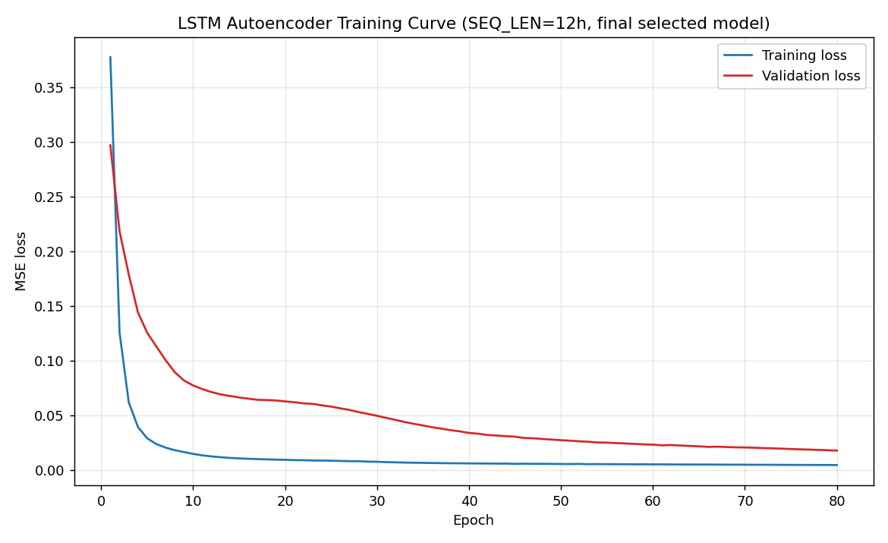
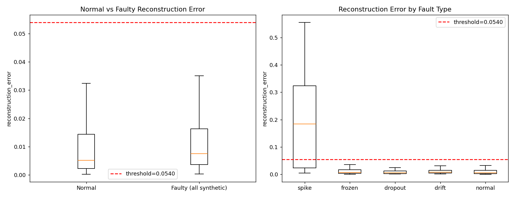
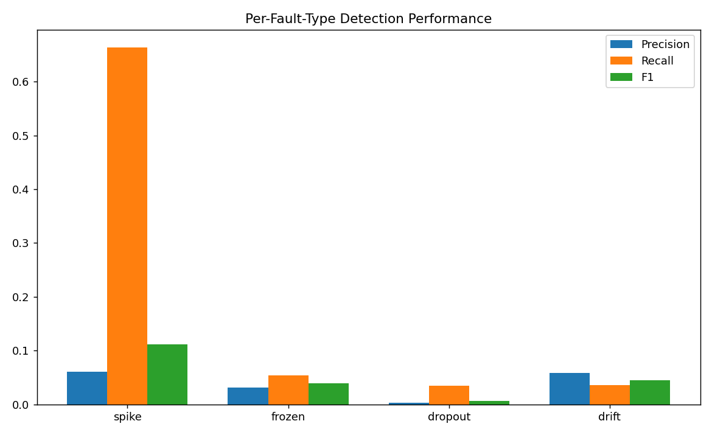
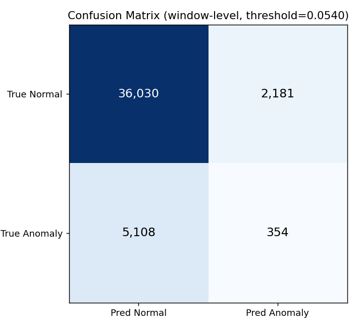
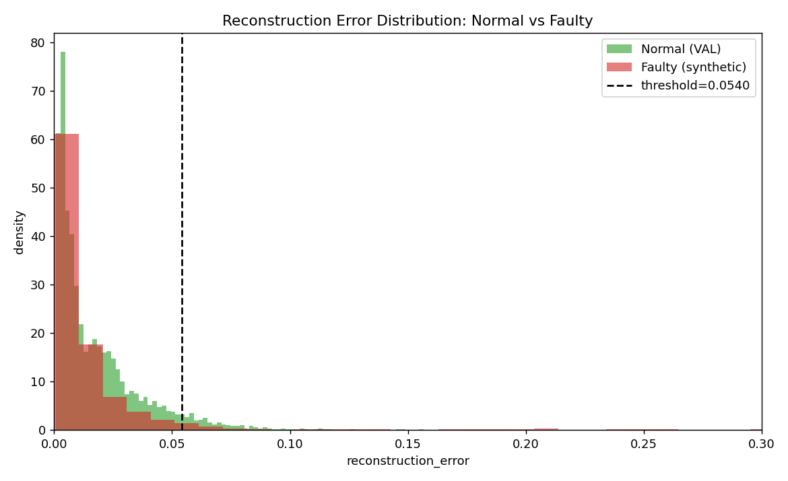
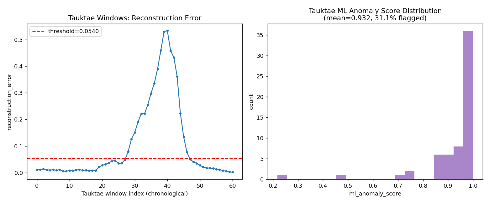

# Agent 3 — ML Anomaly Detection: Evaluation Report

**Model:** LSTM Autoencoder, SEQ_LEN=12h, trained on `clean_dataset.csv` only.
**Evaluated against:** `faulty_dataset.csv` + `ground_truth_labels.csv` (never used for training/fitting).

---

## 1. Data audit summary

- `clean_dataset.csv` and `faulty_dataset.csv`: 43,800 rows each, 5 stations, hourly, 2021-01-01 → 2021-12-31, no schema violations.
- `faulty_dataset.csv` has 200 missing values in each of `temperature_c`/`pressure_hpa`/`humidity_pct` (the `dropout` fault) plus physically implausible extremes (temp −4.8→59.9°C).
- `ground_truth_labels.csv`: 5,535 labeled rows. **No explicit "normal" label** — any `(station_id, timestamp)` absent from this file is normal. Row order does **not** match `faulty_dataset.csv`; all joins are done on `(station_id, timestamp)` keys.
- Fault type counts: drift 3,754, frozen 1,294, spike 215, dropout 200, genuine_event 72.
- Every value-level difference between `clean_dataset.csv` and `faulty_dataset.csv` (5,077 rows) is covered by a label — 0 unlabeled injected faults found.

## 2. Training rules (confirmed)

- Only `clean_dataset.csv` was used to fit the scaler and train the model.
- `faulty_dataset.csv` and `ground_truth_labels.csv` were loaded for the **first time** in the evaluation stage, never during training. Verified programmatically at each pipeline stage (checksums, static source scans, disjoint-key assertions — see `agent3_ml_detection` scratch pipeline logs for full check output).

## 3. Tauktae exclusion

AWS_DIU, 2021-05-16 → 2021-05-18 (72 hourly rows) is excluded from the training pool because it is a real, documented weather event (Cyclone Tauktae), not a synthetic fault — training on it would teach the model to treat a genuine extreme event as "normal," undermining its ability to flag real extreme events later. The 72 rows were **not deleted** from `clean_dataset.csv` on disk (checksum-verified unchanged); they were held out separately and are exactly what section 9 below evaluates.

Removing this window **splits AWS_DIU's training timeline into two disjoint contiguous blocks** (a discontinuity landing inside the train split, not at its boundary). The sequence builder detects time-contiguity explicitly and never lets a sliding window bridge this gap — verified for all sequence lengths tested.

## 4. Features

| Feature | Kept? | Justification (η² against physical variables, train data) |
|---|---|---|
| `hour_sin`/`hour_cos` | ✅ | η²=0.36 (temp), 0.05 (pressure), 0.15 (humidity) |
| `doy_sin`/`doy_cos` | ✅ | η²=0.45 (temp), **0.89 (pressure)**, 0.53 (humidity) — strongest signal |
| `month` | ❌ | redundant with day-of-year at coarser granularity |
| `day_of_week` | ❌ | η² ≤ 0.002 for all variables (weather has no weekly cycle) |
| `station_id` / `latitude` / `longitude` | ❌ | lat/lon are constant per station (1 unique value each) — a direct proxy for station identity; including them risks the LSTM shortcutting "which station" instead of learning genuine temporal behavior |

Station baseline differences (mean temp 26.7–28.4°C across stations) are real and handled via a **separate StandardScaler fit per station on that station's training rows only** — not via a station-identity feature.

Final feature vector (7 dims): `temperature_c_scaled, pressure_hpa_scaled, humidity_pct_scaled, hour_sin, hour_cos, doy_sin, doy_cos`.

## 5. Model

`Input(12,7) → LSTM(64) → LSTM(32,latent) → RepeatVector(12) → LSTM(32) → LSTM(64) → TimeDistributed(Dense(7))`. Adam, MSE loss, seed=42.

**SEQ_LEN selection:** tested 12h/24h/48h. 12h won on validation MSE (0.018 vs 0.183 vs 0.136) *and*, after re-testing all three against labeled faults directly (not just MSE), also won on overall F1 (0.089 vs 0.043 vs 0.040). All three lengths performed similarly poorly on `drift` specifically (F1 0.039–0.044) regardless of window size — see §9 for why.

## 6. Training curve



Validation loss decreases monotonically across all 80 epochs (only 2/79 epoch-to-epoch upticks, both negligible) and never turns upward — **no overfitting observed**. The train/val gap present throughout is the normal signature of an autoencoder fitting its exact training sequences, not evidence of overfitting. Val loss was still trending down when the epoch budget was used up.

## 7. Threshold selection

Candidates derived **only** from the VAL split (100% normal, held-out) reconstruction-error distribution: `p95, p97.5, p99, mean+2σ, mean+3σ`. Each candidate's effect on precision/recall/F1/FPR against labeled faults was studied once (`plots/threshold_plot.png`); the highest-F1 candidate was locked and never re-tuned afterward.

**Locked threshold: 0.0540 (mean + 2σ)**

## 8. Evaluation results (window-level, locked threshold)

| | Precision | Recall | F1 |
|---|---|---|---|
| **Overall** | 0.140 | 0.065 | **0.089** |

Confusion matrix: TP=354, FP=2,181, FN=5,108, TN=36,030 (FPR=5.7%).

| Fault type | n | Precision | Recall | F1 |
|---|---|---|---|---|
| spike | 214 | 0.061 | **0.664** | 0.112 |
| frozen | 1,294 | 0.031 | 0.054 | 0.039 |
| dropout | 200 | 0.003 | 0.035 | 0.006 |
| drift | 3,754 | 0.058 | 0.036 | 0.044 |





## 9. Normal vs faulty reconstruction error

| | mean | median | p95 |
|---|---|---|---|
| Normal | 0.0208 | 0.0052 | 0.0608 |
| Faulty (all synthetic) | 0.0242 | 0.0075 | 0.0691 |
| spike | **0.1912** | 0.1837 | 0.4556 |
| frozen | 0.0210 | 0.0069 | 0.0547 |
| dropout | 0.0203 | 0.0049 | 0.0470 |
| **drift** | **0.0159** | 0.0074 | 0.0462 |

**Key finding: drift's mean reconstruction error is *lower* than normal data's.** The model learned seasonal drift as legitimate behavior via `doy_sin`/`doy_cos`, so a synthetic drift fault that gradually shifts a sensor's baseline is faithfully reconstructed rather than flagged — a genuine architectural limitation of reconstruction-MSE scoring for slow, seasonal-mimicking faults, confirmed independently by the sequence-length re-test in §5.



## 10. Tauktae unseen-event analysis

AWS_DIU's 72 held-out Tauktae rows (61 valid 12h windows) were **never seen during training**.

| Metric | Value |
|---|---|
| Windows | 61 |
| Mean reconstruction error | **0.1023** (5.8× the normal VAL mean) |
| Median / Max | 0.0273 / 0.5339 |
| p95 / p99 | 0.4582 / 0.5319 |
| Mean ML anomaly score | **0.932** |
| Max ML anomaly score | 1.0 |
| % windows flagged anomalous | **31.1%** (vs 5.7% baseline FPR) |



The model clearly recognizes Tauktae as unusual despite never having seen it — reconstruction error tracks the storm's arrival/departure almost exactly (see plot). This is correctly surfaced as an anomalous **event**, not classified as a specific synthetic fault type (that classification belongs to Agent 4).

## 11. ML anomaly score

```
ml_anomaly_score(x) = ECDF_train(reconstruction_error(x))
                     = (# TRAIN reconstruction errors ≤ error(x)) / N_train
```
Bounded [0,1], monotonic by construction, deterministic against a fixed saved reference distribution (`models/train_error_reference_sorted.npy`, N=30,543), directly interpretable, grounded in the real training distribution rather than an arbitrary constant, contains no root-cause information.

## 12. Multi-level evaluation

| Level | Overall | drift | frozen | dropout | spike |
|---|---|---|---|---|---|
| Window (exact 12h window flagged?) | F1=0.089 | R=0.036 | R=0.054 | R=0.035 | R=0.664 |
| Timestamp (hour covered by ≥1 flagged window?) | F1=0.173 | R=0.155 | R=0.175 | R=0.125 | R=0.693 |
| Event (incident caught at least once, anywhere in its span?) | 34.0% detected | R=31.6% | R=19.7% | R=12.1% | R=69.2% |

These three numbers answer different questions and should never be compared as if interchangeable. Event-level is the most operationally relevant ("did we catch the incident"); window-level is the strictest and the one the locked threshold was tuned against.

## 13. Baseline comparison

A causal rolling z-score baseline (12h window, per-station, per-variable) was evaluated identically to the LSTM.

| | Precision | Recall | F1 | FPR |
|---|---|---|---|---|
| LSTM Autoencoder | 0.140 | 0.065 | 0.089 | 0.057 |
| Rolling z-score (own best F1) | 0.132 | 0.388 | 0.197 | 0.360 |
| Rolling z-score (**matched to LSTM's ~6% FPR**) | 0.180 | 0.093 | **0.123** | 0.060 |

**The simple statistical baseline outperforms the LSTM even at a matched, fair operating FPR.** Per spec instruction, this is reported honestly rather than downplayed: the added complexity of the LSTM Autoencoder is not currently justified by the evaluation evidence for this dataset/fault mix.

## 14. Failure analysis

| Issue | Severity | Evidence | Technical cause | Improvement |
|---|---|---|---|---|
| Drift detection | Severe | Recall 0.036; mean error *below* normal | Drift resembles trained seasonal signal | Add long-window rate-of-change features; separate slow-drift detector |
| Dropout detection | Severe | Recall 0.035 | Forward-fill imputation makes dropout resemble "frozen" | Add explicit missingness indicator feature instead of silent imputation |
| Frozen-sensor detection | Moderate-severe | Recall 0.054 | Short flat segments within a 12h window may not move window MSE enough, especially overnight when real temp is naturally near-flat | Add explicit rolling-variance feature |
| Spike detection | Good | Recall 0.664, 9× normal error | Large point deviations are exactly what reconstruction-MSE is sensitive to | Minor precision gains possible via feature-level thresholds |
| Weakest station (AWS_MAHUVA, F1=0.062) vs best (AWS_DIU, F1=0.134) | Moderate | ~2× spread despite per-station scaling | Needs direct inspection — not assumed to be a scaling artifact | Inspect station-specific fault windows directly |
| Seasonal false positives | Low (found: Oct–Nov, not monsoon as hypothesized) | FP rate spikes to 12.7%/16.0% in Oct/Nov vs ~3-5% elsewhere; monsoon (Jun-Sep) is actually *under*-represented in FPs (25.5% vs 33.9% baseline share) | Post-monsoon transition volatility, not monsoon itself | Consider season-specific thresholds if confirmed at scale |
| Architecture value vs baseline | Severe | Baseline F1=0.123 beats LSTM F1=0.089 at matched FPR | Reconstruction-MSE LSTM not clearly better than local statistics for this fault mix | Hybrid: z-score for sudden deviations + LSTM/long-window stats for drift |

## 15. Scientific honesty statement

All numbers in this report are computed directly from `faulty_dataset.csv` + `ground_truth_labels.csv` via the locked pipeline — none are fabricated, and the threshold was selected once (§7) and never re-tuned to chase a target number. Overall detection performance is **weak** (F1≈0.09 window-level) and the simple statistical baseline is competitive or better — this is reported as-is per the "scientific honesty" requirement, not adjusted or hidden. **These results are on synthetic, injected faults and are not equivalent to real-world deployment validation** — real sensor faults may differ in magnitude, duration, and co-occurrence with genuine weather extremes from what `faulty_dataset.csv`'s fault injector produces.

## 16. Recommendations for future work

1. Add explicit rate-of-change / rolling-variance features to address drift and frozen detection.
2. Add a missingness indicator channel instead of forward-fill imputation.
3. Build the hybrid statistical+LSTM approach flagged in §13/14 rather than relying on reconstruction-MSE alone.
4. Investigate the AWS_MAHUVA station-specific gap directly.
5. Re-run with a longer training budget — val loss had not fully converged (§6).
